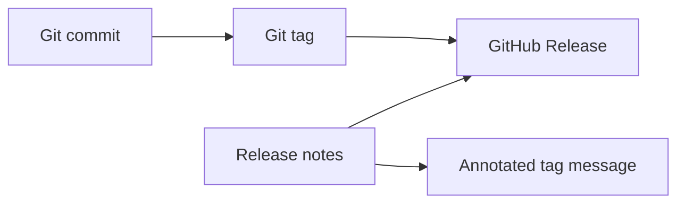
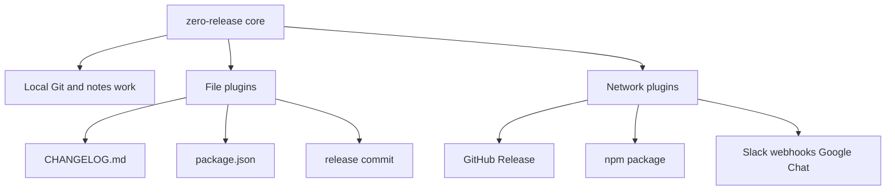

# Concepts

This page defines the release terms zero-release uses throughout the docs.

## Tags and releases

A Git tag is a Git reference that points to a commit. zero-release creates annotated tags by default:

```text
v1.2.3 -> commit abc123
```

A GitHub Release is platform metadata attached to a Git tag. It can have a title, body, assets, and prerelease state. It is created only when the `github-release` plugin is enabled.



## Release notes and changelog

Release notes describe one release. zero-release always creates a release notes file before `prepare` and `publish`.

A changelog is the persistent history of release notes, usually stored in `CHANGELOG.md`.

| Term | Scope | In zero-release |
|---|---|---|
| Release notes | One version | Generated for the current release |
| Changelog | Release history | Updated by the `changelog` plugin |
| Git tag | Exact code point | Created and pushed by the core |
| GitHub Release | GitHub publication | Created by the `github-release` plugin |

## Core and plugins

The core does local release automation: commit analysis, version calculation, notes, tags, and hook orchestration.

Plugins are explicit adapters for file changes, publishing, and notifications.



## Dry-run

Dry-run mode answers "what would happen?" without changing files, creating tags, pushing commits, publishing packages, creating GitHub Releases, or sending notifications.

Pull request workflows default to dry-run in GitHub Actions.

