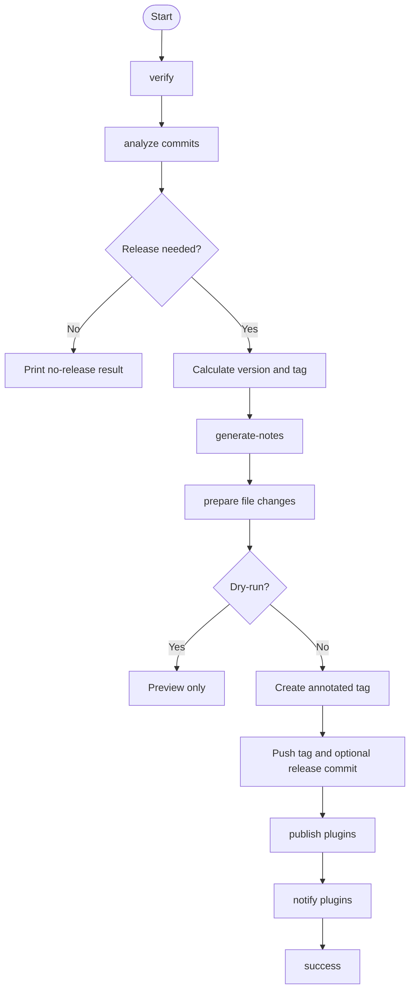
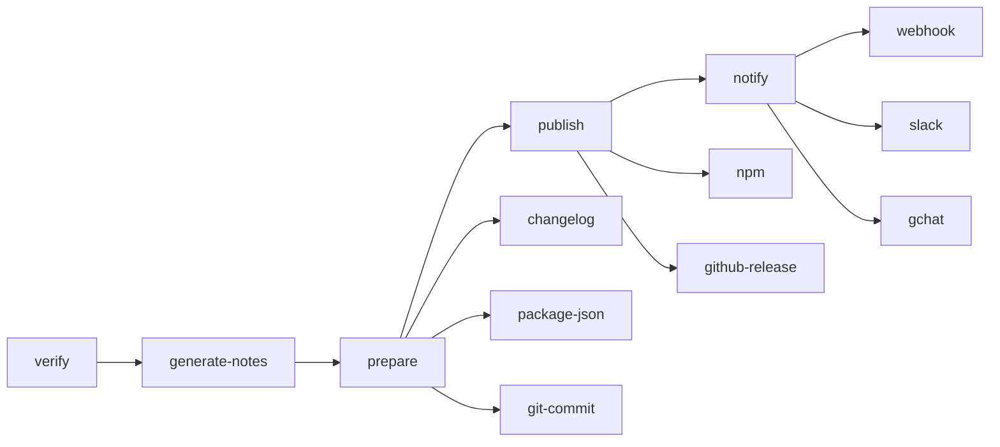

# Lifecycle

The CLI uses semantic-release-like lifecycle names, but zero-release is not semantic-release compatible.

## Hooks

```text
verify
analyze
verify-release
generate-notes
prepare
publish
notify
success
fail
```

Core analysis and publishing are handled by the CLI. Plugins are executable hook adapters and receive context through `ZERO_RELEASE_*` environment variables.

## Release flow



If no release-worthy commits are found, zero-release reports that no release was produced and skips release actions.

If `--dry-run` is enabled, zero-release previews the release and skips mutations and network plugins.

## Plugin order

Plugin execution order is deterministic and based on lifecycle responsibility, not on the order passed to `--plugins`.



Prepare plugins run in this order when enabled:

```text
changelog
package-json
git-commit
```

Publish plugins run in this order when enabled:

```text
npm
github-release
```

Notify plugins run in this order when enabled:

```text
webhook
slack
gchat
```

## Generated notes

The core always produces a release notes file before `prepare` and `publish`.

Enabling `release-notes` makes notes generation explicit and leaves room for alternate notes plugins, but `changelog`, annotated Git tags, and `github-release` can consume generated notes even when `release-notes` is not listed.
