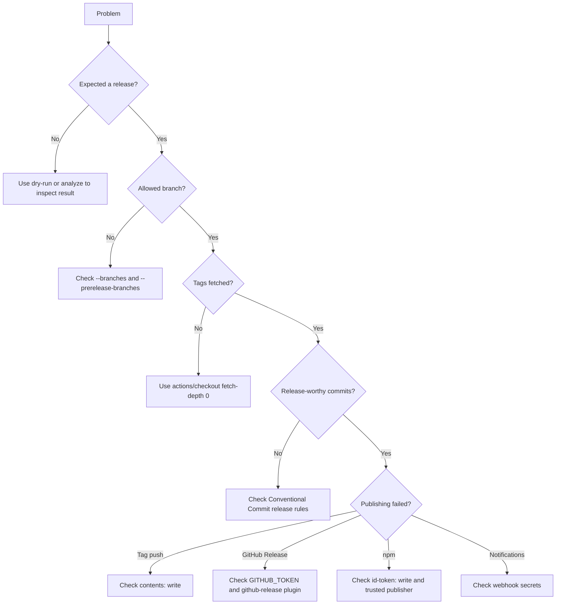

# Troubleshooting

Use `zero-release doctor` first when a workflow behaves unexpectedly.

```bash
zero-release doctor
zero-release doctor --json
```

## Diagnosis flow



## Common symptoms

| Symptom | Check |
|---|---|
| No previous tag is detected | Use `actions/checkout` with `fetch-depth: 0` |
| No release is produced | Confirm commits use `feat:`, `fix:`, `perf:`, or breaking-change syntax |
| Release works locally but not in CI | Check branch allowlists and GitHub event type |
| Tag push fails | Add `permissions: contents: write` |
| GitHub Release fails | Enable `github-release` and provide `GITHUB_TOKEN`, `GH_TOKEN`, or `ZERO_RELEASE_GITHUB_TOKEN` |
| npm publish fails | Configure npm Trusted Publishing and `id-token: write` |
| Changelog changes are not committed | Enable `git-commit` after `changelog` or `package-json` |
| Network plugin runs during PR preview | It should not; confirm `--dry-run` is active or the event is `pull_request` |

## Useful commands

```bash
zero-release --dry-run --debug
zero-release analyze --json
zero-release doctor --json
git tag --list
git log --oneline
```
